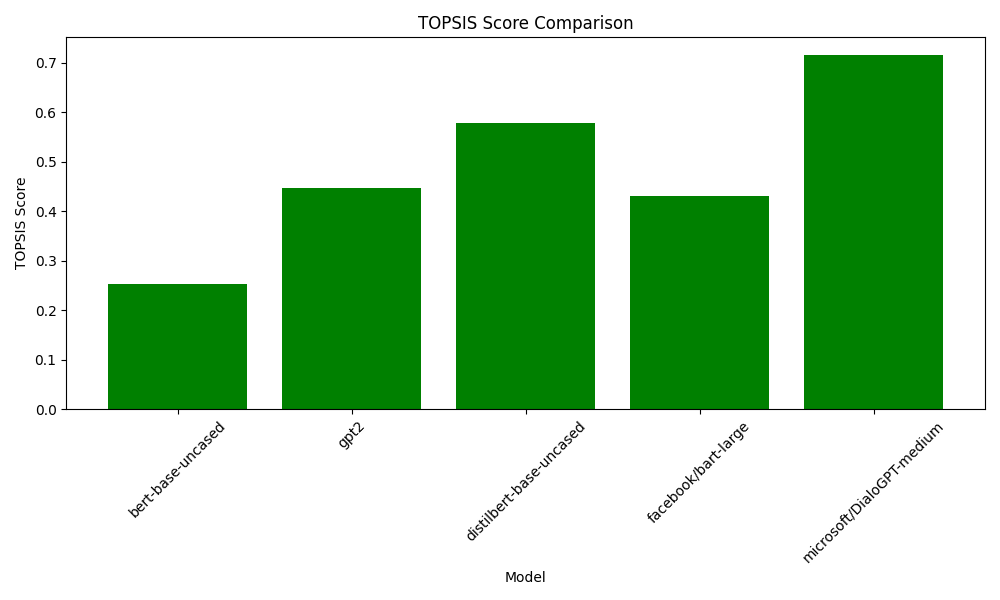

# Apply-Topsis-to-find-best-model-for-text-conversational

## Overview

This project compares various language models using the TOPSIS method, focusing on metrics like accuracy, response time, perplexity, F1 score, and memory usage.

## Key Features

1. **Metrics Considered:** Accuracy, Response Time, Perplexity, F1 Score, and Memory Usage.
2. **Methodology - TOPSIS:** Utilizes TOPSIS for a balanced evaluation of models.
3. **Models Evaluated:** Includes BERT, GPT-2, DistilBERT, BART, and DialoGPT.

## Project Structure

- **`model_performance.csv`**: Contains performance metrics for each model.
- **`result.csv`**: Lists TOPSIS scores and rankings.
- **Metric Comparison Charts**: Bar charts for visual comparison of model performance.

## How to Run

1. **Clone the Repository:**
2. **Execute the Analysis Script:**
- The script will perform TOPSIS analysis and generate comparison charts.

## Results and Analysis

1. **TOPSIS Ranking:** `result.csv` provides a ranked list of models.

2. **Performance Charts:** Visual comparison of each model's performance across different metrics.

## Analysis

- **Model Insights:** Gain insights into which models excel in accuracy, efficiency, and overall balance.
- **Efficiency Consideration:** Evaluate models based on memory usage and response time.
- **Future Research:** Use these findings as a basis for further research and application-specific model selection.

## Conclusion

This project aids researchers and practitioners in NLP by offering a systematic way to evaluate and compare language models across key performance metrics.

